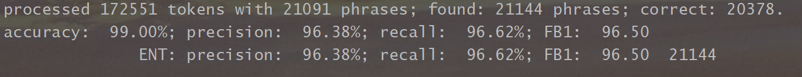
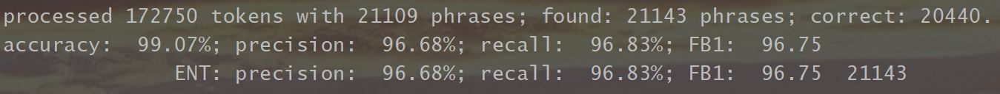

# Simple Question Answering

This is the code for using Google Bert model on SimpleQuestions dataset, a widely studied KBQA benchmark dataset.


1. use bert to achieve a better NER result
2. using bert + CNN based model to do relation ranking (On-going)

## note:
* this is an on-going project, which will be constantly changed in the following month.
* results shown right now are preliminary


## preliminary results

1. NER result (entity level metrics, following conlleval)

* 1 epoch


* 2 epoches



## Prerequisites

This repository requires Python 3.6 or greater and ElasticSearch.

## Installation

* Clone the repository and cd into it
```
git clone git@github.com:michael-wzhu/BERT-for-SimpleQuestions.git
cd BERT-for-SimpleQuestions
```


## referenced GitHub Repositories
- https://github.com/macanv/BERT-BiLSTM-CRF-NER
